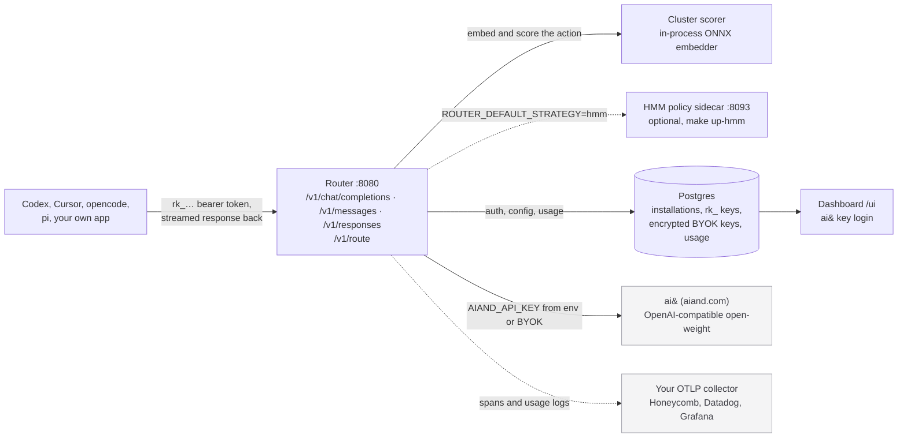

<div align="center">


**One endpoint. Every open-weight model. Always the right one.**

An OpenAI-compatible router built **exclusively for [ai&](https://aiand.com)**
(aiand.com): it picks the best open-weight model for every request — per
*action*, not per turn — using a tiny on-box embedder, not a vibes-based
prompt. `POST /v1/chat/completions` is the product lead; `POST /v1/messages`
(Anthropic wire) and `POST /v1/responses` (OpenAI Responses, for Codex CLI)
are translated ingresses on the same catalog.

[](go.mod)
[](https://github.com/fenilmodi00/aiand-router/actions/workflows/test.yml)
[](https://www.npmjs.com/package/aiand-router)

*ai&-exclusive OpenAI-compatible router, published as `aiand-router` on npm
(Go module `aiand/router`); HTTP override headers use the `x-aiand-*` prefix.
Built on [workweave/router](https://github.com/workweave/router).*

> **Status:** internal prototype under active testing. Expect churn; pin a
> version in production installs.

</div>

## What it does

Point Codex, Cursor, opencode, pi, or your own app at the router. Built
exclusively around the ai& inference API, it:

- 🎯 **Routes per action.** A cluster scorer derived from
  [Avengers-Pro](https://arxiv.org/abs/2508.12631) [^1] runs a tiny in-process
  ONNX embedder over each action and picks the right open-weight model from
  the ai& catalog. Routes per **action**, not per turn — see
  [docs/SEMANTICS.md](docs/SEMANTICS.md) for the canonical terminology.
- 🧠 **ai&-only catalog.** DeepSeek, Kimi, GLM, Qwen, Motif, gpt-oss — via
  `AIAND_API_KEY` at `api.aiand.com/v1`, Japan-resident
  OpenAI-compatible inference. One provider, one key, six catalog rows.
- 🔌 **Three ingress wires, one turn loop.** `POST /v1/chat/completions`
  (lead, native), `POST /v1/messages` (Anthropic wire → translated), and
  `POST /v1/responses` (OpenAI Responses → translated; the surface Codex CLI
  requires). All three route on the same catalog and share the session-pin
  and failover machinery.
- 📌 **Session pinning with cache-aware economics.** Every session pins to a
  model; an expected-value planner compares staying (warm prompt cache) vs
  switching (fresh scorer pick) each turn using live cache-read multipliers
  and the pin's measured cache-hit share, switching only when the math says
  it pays. User-forced pins never expire.
- 🔒 **BYOK by default, encrypted at rest.** Per-installation ai& keys ride
  the router encrypted with Tink AES-256-GCM; the deployment key is optional
  where each signed-in user's own key bills their usage.
- 🛡️ **Agentic failure handling.** Classifies upstream errors, retries with
  sibling-binding failover, detects output-cap runaways and cyclic loops
  (with escalation to a stronger tier), breaks text-repetition spirals, and
  two-strike-evicts a failing pinned model.
- 💾 **Semantic response cache.** Repeat/identical requests served from an
  in-process semantic cache, configurable TTL and bucket size.
- 📊 **Observable.** OTLP traces and per-decision span export out of the
  box — see them in your own collector (Honeycomb, Datadog, Grafana) or
  query the raw decision log via `/v1/analytics/*` with a read-only `ra_`
  key. `/router-feedback` in chat lets users rate routing decisions, which
  feeds routing telemetry.
- 🖥️ **Dashboard.** Metrics, per-model breakdown, usage/savings, model
  selection (excluded/allowed lists), playground for previewing routing
  decisions, live ai& catalog view, and BYOK provider-key management.
  Login is your ai& `sk-` key (`POST /account/v1/login`).

## How routing works

One request travels this path:

1. **Ingress.** A `POST /v1/chat/completions` (or translated
   `/v1/messages` / `/v1/responses`) lands with an `rk_` bearer token. Auth
   resolves the installation, its excluded/allowed models, BYOK keys, and
   spend caps.
2. **Force check.** Routing intent is read from the `model` field (or
   `/force-model` command, or `x-aiand-force-model` header — in that
   precedence). A catalog ID/alias forces that model with a user pin that
   never expires; `auto` routes normally.
3. **Pin check.** The session key (derived from installation + session
   identity) is looked up in the pin store. A live pin on the same strategy
   rehydrates its decision without re-scoring.
4. **Score.** On a fresh turn, the cluster scorer embeds the action text
   with the in-process ONNX embedder, scores it against the frozen
   Avengers-Pro–derived model registry (clustered by task type, with tier,
   tool-use quality, agentic-use, image-input, and pricing axes), and
   produces a ranked recommendation filtered by the installation's
   model-selection rules.
5. **Plan.** The EV planner compares the pin vs the fresh pick:
   `switch when expected savings (warm-cache price delta × tokens) −
   eviction cost > threshold`, gated by the pin's measured cache-hit share
   and a tier-upgrade guard. A cold pin is priced uncached so a phantom
   cache can't glue a session to a stale model.
6. **Dispatch.** The chosen binding is called on ai& (deployment key or
   installation BYOK key). Upstream errors are classified; retryable ones
   retry in-place (single-binding catalog) or via sibling-model failover;
   two consecutive non-retryable failures may evict the pin and re-route.
7. **Protect.** Output-cap runaways, cyclic tool loops (escalating to a
   stronger tier), and text-repetition spirals are detected and broken;
   handover summarization can bound SWITCH cost; stale thinking-block
   signatures are stripped on cross-model switch.
8. **Record.** The decision, usage, and cost go to Postgres (metrics,
   analytics export) and OTel spans; the semantic cache may serve
   the next identical non-streaming request; usage updates the pin's cache
   telemetry for the next planner run.

Routing strategy is pluggable behind one interface: the default in-process
**cluster** scorer, an optional frozen **HMM** policy sidecar, an opt-in
**RL/DPO** sidecar, and a **bandit** posterior router — selectable per
request via headers, per session via the `/beta` toggle, or left at the
deployment default.

## 30-second quickstart

The fastest way: point Codex, opencode, or pi at a hosted router with one
command. No clone, no Docker, no Postgres.

```bash
npx aiand-router
```

That's it. The installer asks which tool (Codex, opencode, pi, or optionally
Claude Code), walks you through scope (user vs. project), grabs a router key,
and wires the right config file. Other flavors:

```bash
npx aiand-router --codex               # skip the picker, OpenAI Codex CLI
npx aiand-router --opencode            # skip the picker, opencode
npx aiand-router --pi                  # skip the picker, pi + Loom UI
npx aiand-router --claude              # optional: Claude Code harness
npx aiand-router --scope project       # per-repo, commits settings.json (or .codex/ / opencode.json)
npx aiand-router --local               # self-hosted localhost:8080
npx aiand-router --base-url https://router.acme.internal
npx aiand-router@0.3.0                 # pin a version
```

Requires Node ≥ 18 (opencode, pi, and Claude Code paths also need `jq`). Full
flag reference: [install/npm/README.md](install/npm/README.md).

### Or: self-host the whole stack

If you want the router (and dashboard) running on your own box:

```bash
# 1. Drop the ai& key in. AIAND_API_KEY is the deploy baseline.
echo "AIAND_API_KEY=sk-..." >> .env.local

# 2. Boot Postgres + router on :8080 and seed an rk_ key.
make full-setup
```

The router is up at <http://localhost:8080>, the dashboard at
<http://localhost:8080/ui/> (log in with your ai& `sk-` key), and your
`rk_...` key prints in the logs. Open **Playground** at
<http://localhost:8080/ui/playground> to preview routing decisions and send
test chat turns.

```bash
# Lead surface: OpenAI Chat Completions (catalog IDs)
# model="auto" routes normally (scorer picks per action)...
curl -sS http://localhost:8080/v1/chat/completions \
  -H "Authorization: Bearer rk_..." \
  -d '{"model":"auto",
       "messages":[{"role":"user","content":"hi"}]}'

# ...and a catalog ID or alias in `model` forces exactly that model,
# same user-forced pin as /force-model / x-aiand-force-model.
curl -sS http://localhost:8080/v1/chat/completions \
  -H "Authorization: Bearer rk_..." \
  -d '{"model":"moonshotai/kimi-k2.7",
       "messages":[{"role":"user","content":"hi"}]}'

# Optional :level effort suffix rides along (kimi-k3:high).
curl -sS http://localhost:8080/v1/chat/completions \
  -H "Authorization: Bearer rk_..." \
  -d '{"model":"moonshotai/kimi-k3:high",
       "messages":[{"role":"user","content":"hi"}]}'

# Secondary: Anthropic Messages ingress (same catalog after translate)
curl -sS http://localhost:8080/v1/messages \
  -H "Authorization: Bearer rk_..." \
  -d '{"model":"moonshotai/kimi-k2.7","max_tokens":256,
       "messages":[{"role":"user","content":"hi"}]}'

# Peek at the routing decision without proxying
curl -sS http://localhost:8080/v1/route -H "Authorization: Bearer rk_..." -d '...'

# Dashboard playground: preview a routing decision (account cookie, not rk_;
# /account/v1/login takes your ai& sk- key)
curl -sS -c jar -X POST http://localhost:8080/account/v1/login \
  -H 'content-type: application/json' -d '{"key":"sk-..."}'
curl -sS -b jar -X POST http://localhost:8080/v1/playground/route \
  -H 'content-type: application/json' \
  -d '{"model":"auto","messages":[{"role":"user","content":"hi"}]}'
```

The `model` field is routing intent: `model="auto"` (the default) routes
normally, while a catalog ID or retired catalog alias forces that model —
exactly equivalent to `/force-model` or `x-aiand-force-model` (same session
pin, same-turn serving, same HTTP 400 on unknown values). Precedence is
`/force-model` command > `model` field > `x-aiand-force-model` header; `auto`
never clears an existing pin. Claude-era short names are not remapped — see
[docs/CONFIGURATION.md](docs/CONFIGURATION.md#client-model-strings--catalog-ids)
and the [routing-intent section](docs/CONFIGURATION.md#routing-intent-via-the-model-field).

### What that stack looks like

Only the grey boxes are off your machine. The router, the scorer, Postgres, and
your provider keys all stay local; prompts go from the router straight to ai&,
never anywhere else.



### Optional: self-host the frozen HMM policy

The default stack uses the in-process cluster scorer. To run the frozen HMM
policy as a companion container, add a Google API key and use the opt-in target:

```bash
echo 'GOOGLE_API_KEY=...' >> .env.local
make up-hmm
```

This does not change the default strategy. See
[`sidecars/hmm/README.md`](sidecars/hmm/README.md) for artifact verification,
embedding compatibility, and explicit HMM selection.

## Wire it into your tools

**Codex** (OpenAI CLI). `npx aiand-router --codex` patches
`~/.codex/config.toml` (or `<repo>/.codex/config.toml` with `--scope project`)
with a managed `[model_providers.aiand]` block and sets `model_provider = "aiand"`.
The provider preserves Codex's existing ChatGPT OAuth login while the router
key rides in an `X-Aiand-Router-Key` HTTP header. `--codex --local` and custom
self-hosted URLs keep their router's configured default strategy (HMM sidecar
is optional). Routed open-weight models go to **ai&** via the router's
`AIAND_API_KEY` or installation BYOK. Codex does not load third-party
slash-command files; send router directives with one leading space (for
example, ` /force-model moonshotai/kimi-k2.7`). Re-install and
`--uninstall --codex` rewrite/remove only the managed block, leaving the
rest of your Codex config untouched. Invoke `$disable-routing` to switch the
next Codex session back to its normal provider, or run
`npx aiand-router disable-routing` in a shell; a literal
`/disable-routing` is not a third-party extension point in Codex.

**opencode.** `npx aiand-router --opencode` merges a `provider.aiand`
entry into `~/.config/opencode/opencode.json` (or `<repo>/opencode.json`
with `--scope project`). It uses opencode's bundled Anthropic SDK provider
pointed at the router's `/v1` endpoint — the secondary `/v1/messages` ingress
accepts that wire and translates to OpenAI-compat for aiand. The router
key and identity headers ride alongside the provider config; re-install
rewrites only the managed block and `--uninstall --opencode` strips it.

**pi.** `npx aiand-router --pi` keeps stock pi as the runtime and installs
the router's pi extension. It adds the Loom header, Wooly's animated terminal
mascot, a persistent `AIAND ROUTER` route/savings line, `/fm` + `/ufm`
model-pin commands with a `[forced]` status, and context-isolated subagents
without shipping or maintaining a forked pi binary.

**Cursor** *(early beta, performance may not be the best).* Settings →
Models → *Override OpenAI Base URL* → `http://localhost:8080/v1`, paste
`rk_...` as the API key.

**Claude Code** *(optional harness).* `make install-cc` wires Claude Code at
the local self-hosted router (also invoked at the end of `make full-setup`).
For a hosted router, `npx aiand-router --claude`. Pin with catalog IDs
(Claude-era short names are not remapped — see
[CONFIGURATION](docs/CONFIGURATION.md#client-model-strings--catalog-ids)).

**Switching on/off.** After installing, `npx aiand-router off --codex`
(or `--opencode` / `--claude`) routes that client straight to its provider
again without discarding the router config; `on` flips it back, and `status`
reports which way it's pointing. See [install/README.md](install/README.md#switching-on-and-off).

**Choosing which models the router may pick.** `npx aiand-router models
--codex` lists every deployed model with its on/off state, and `models enable`
/ `models disable` change it — the same setting as the dashboard's settings
page, edited from the terminal. Requires a router that serves the
model-selection API; against a hosted router the list still prints and
points you at the dashboard, where selection is an organization-wide setting.
See [install/README.md](install/README.md#choosing-which-models-the-router-may-pick).

> Two keys, don't mix them up:
> - `AIAND_API_KEY` (`sk-…`) = your **upstream** ai& key. Lives in `.env.local`.
> - `rk_...` = your **router** key. Clients send this as a Bearer token.

## Endpoints

| Endpoint                       | Format                                   |
| ------------------------------ | ---------------------------------------- |
| `POST /v1/chat/completions`    | OpenAI Chat Completions, routed (lead)   |
| `POST /v1/responses`           | OpenAI Responses ingress (Codex CLI), translated to chat internally |
| `POST /v1/messages`            | Anthropic Messages ingress, routed (peripheral) |
| `POST /v1/route`               | Returns the decision, no upstream call   |
| `GET /v1/models` &nbsp;·&nbsp; `POST /v1/messages/count_tokens` | Passthrough helpers |
| `GET /v1/router/policies` &nbsp;·&nbsp; `GET /v1/router/models` &nbsp;·&nbsp; `GET /v1/router/routing-distribution` | Unauthed strategy catalog, model list, dial projection |
| `GET /v1/router/hmm-roster`   | HMM sidecar roster, when wired          |
| `GET /health` &nbsp;·&nbsp; `GET /readyz` &nbsp;·&nbsp; `GET /validate` &nbsp;·&nbsp; `GET /v1/version` | liveness + dependency readiness + key check + build info |
| `GET /v1/sessions/:session_id/cost` | One session's committed cost + savings, scoped to your key |
| `GET /v1/analytics/routing-decisions` | Raw routing decisions as cursor-paginated NDJSON, `ra_` key ([docs](docs/ANALYTICS_EXPORT.md)) |
| `GET /v1/analytics/schema` &nbsp;·&nbsp; `GET /v1/analytics/models` | Export field dictionary + price book |

Ingress auth is the `rk_` router key (Bearer). Analytics export uses a
separate read-only `ra_` key that can never reach an inference route. Dashboard
data plane is cookie-authed via ai& key login (`POST /account/v1/login`).

Keep liveness probes on `/health`. Point startup or readiness probes at
`/readyz` when configured policy sidecars must be ready before traffic arrives.

## The ai& catalog

Six open-weight models are bound to ai& (single source of truth:
[`internal/router/catalog`](internal/router/catalog/catalog.go); the
dashboard's Models page also shows the live per-org list from
`GET /v1/models` on ai&):

| Catalog ID | Tier | Context | Efforts | In/Out $/1M |
|---|---|---|---|---|
| `deepseek-ai/deepseek-v4-flash` | low | 1M | none/high/max | $0.15 / $0.25 |
| `qwen/qwen3.8-27b` | low | 262K | none/low/medium/xhigh | $0.40 / $3.00 |
| `motif-technologies/motif-3` | mid | 262K | low/medium/high | $0.50 / $2.00 |
| `moonshotai/kimi-k2.7` | high | 262K | high | $0.75 / $3.50 |
| `zai-org/glm-5.3` | high | 1M | none/low/xhigh/max | $1.00 / $4.00 |
| `moonshotai/kimi-k3` | high | 1M | low/high/max | $3.00 / $12.50 |

Retired IDs (`glm-5.2`, `qwen3.6-27b`, …) stay resolvable through
`catalog.aliases` so old pins and client integrations keep landing on the
right row. Claude-era short names (`opus`, `sonnet`, `haiku`, …) are **not**
remapped — pin a catalog ID instead (see
[CONFIGURATION](docs/CONFIGURATION.md#client-model-strings--catalog-ids)).

## Deployment

Single "hosted" mode: the dashboard is mounted at `/ui/*` and its data plane
at `/v1/*`. Login is your ai& `sk-` key (`POST /account/v1/login`). Upstream
credential is `AIAND_API_KEY` from env or per-installation/per-user BYOK keys.

## Versioning & releases

`main` is the single branch. Releasing: bump `version` in
`install/npm/package.json`, merge to `main`, push a `router-v*` tag —
[`publish_npm.yml`](.github/workflows/publish_npm.yml) publishes the npm
package (tag must match the package version and be reachable from `main`).
Releases also carry the frozen HMM artifact
([`hmm-model-v1`](https://github.com/fenilmodi00/aiand-router/releases/tag/hmm-model-v1)),
pinned by sha256 in CI and the sidecar.

## Give routing feedback

`/router-feedback <up|down> [note]` in any wired chat client rates the last
routing decision; the verdict persists (`router.router_feedback`), short-circuits
routing, and emits a `router.feedback.command` span. The HTTP feedback pages
were removed — `ROUTER_FEEDBACK_*` env vars are ignored.

## Deeper docs

- 📐 [**Configuration reference**](docs/CONFIGURATION.md): every env var,
  BYOK encryption, OTel knobs, cluster routing, dashboard auth.
- 🧭 [**Semantics and terminology**](docs/SEMANTICS.md): canonical definitions
  for session, round, turn, action, and step.
- 🧩 [**Adding models (six-model roster)**](docs/adding-glm-5-3.md): catalog +
  cluster overlay pattern for ai& rows.
- 📊 [**Analytics export**](docs/ANALYTICS_EXPORT.md): pulling raw routing
  decisions into your own warehouse with a read-only key.
- [**Policy router harness**](docs/POLICY_ROUTER_HARNESS.md): contract and
  rollout checklist for adding an out-of-process policy model.
- 🛠️ [**Contributing**](CONTRIBUTING.md): layering rules, hot-reload dev,
  schema changes, tests, the whole engineering loop.
- 🏗️ [**Architecture**](AGENTS.md): package layout, import contracts,
  recipes for adding endpoints / models / strategies. Glossary: [CONTEXT.md](CONTEXT.md).

## Credits

This router is built on top of
[workweave/router](https://github.com/workweave/router) — the open-source model
router for agentic systems by [WorkWeave](https://github.com/workweave). The
cluster scorer, session-pin machinery, and multi-ingress architecture originate
there; this tree adapts that codebase exclusively for the ai& inference API.

---

[^1]: Zhang, Y. et al. *Beyond GPT-5: Making LLMs Cheaper and Better via
    Performance–Efficiency Optimized Routing* (Avengers-Pro).
    arXiv:2508.12631, 2025. <https://arxiv.org/abs/2508.12631>
