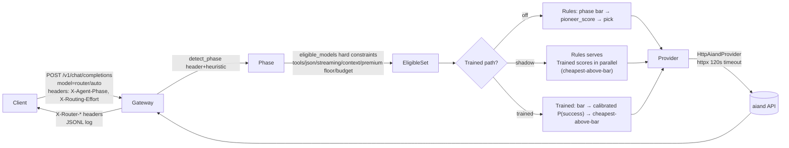

# aiand-router Prototype → Pioneer-Class Router: Achievements, Math & Path to Production

**Date:** 2026-08-21
**HEAD commit:** `492a192` (branch `v0`) — `Deepen hop, gold fit, and promotion gate into shared modules so serve and train share one PathPolicy/EligibleSet, one fit/label seam, and one §(a) bar source.`
**Parent:** `76e92e9` — Ship shadow router prototype
**Authors:** aiand-router team
**Status:** Confidential — for AI& leadership review
**Classification:** Prototype evaluation. No `TRAINED_PATH=trained` in production. Shadow-only until Verified gate.

> **How to read this report.** Executives: read §1–3, §5–8. Technical reviewers: read §4 + Appendix. Every number cites a `file:line` or the gap analysis at `.omo/notepads/pioneer-capacity/research-fireworks-pioneer-gap-2026-08-21.md`.

---

## 1. Cover

| Field | Value |
|-------|-------|
| Title | aiand-router Prototype → Pioneer-Class Router: Achievements, Math & Path to Production |
| Date | 2026-08-21 |
| HEAD | `492a192` on `v0` (`git log --oneline -1`) |
| Authors | aiand-router team |
| Distribution | AI& (aiand) leadership — Confidential |
| Predecessor docs | `AGENTS.md` (commit 492a192), `config/models.yaml`, `.omo/plans/pioneer-capacity.md`, gap analysis `research-fireworks-pioneer-gap-2026-08-21.md` |

**Confidentiality note:** This document describes a prototype gateway that proxies to the aiand API. It contains no customer data. Cost figures use public catalog prices at `config/models.yaml:68-243` and `https://docs.aiand.com/models/catalog/`. Do not distribute outside AI&.

---

## 2. Executive Summary

1. **Prototype proves the seam.** A single OpenAI-compatible gateway (`router/auto`) routes each coding-agent hop to the cheapest capable aiand model. The routing contract — hard constraints → phase bar → score — is shared between serving and training at `src/aiand_router/router.py:234,301,350` and `src/aiand_router/scorer.py:301,550,662` (`492a192` unified seam).

2. **Gateway works today; learned path is shadow-only by design.** Rules serve production. The trained scorer runs in shadow (`TRAINED_PATH=shadow`, `tests/conftest.py` clamps it) and never expands the eligible set. Quality-first means Kimi K3 is reachable at `effort=max` and never below (`config/models.yaml:64` `premium_aa_floor: 58`).

3. **Who wins today: rules — by design.** Head-to-head at `492a192` (see §3.7): rules are production-ready and eligible-correct; scorer is shadow-only, faithfully calibrated on small n (BSS 0.404 PASS, equal-width ECE 0.013 PASS, equal-mass ECE 0.034 FAIL) but built on `bootstrap_partial` data (sparse 0.4–2k not 4k, dense/cal ~300, K3 silver-only). Rules serve until the Verified 500 gate flips it. See §3.7 for posture, intent, and head-to-head table.

4. **$50 training run is at spec-margin, honestly labeled `bootstrap_partial / not_spec_floors`.** Sparse gold ~430–2000 rows, dense/cal ~300, tune ~300, K3 zero gold cells, teacher Motif-3 → GLM 5.2 escalate ≤25% (`src/aiand_router/train.py:34-55`). Frontier routing cannot be calibrated without paid K3 labels — correct to defer.

5. **Calibration is implemented and gated.** Platt sigmoid and isotonic PAVA both ship (`src/aiand_router/train.py` `_fit_platt`/`_fit_isotonic`, `src/aiand_router/scorer.py:231`), auto-select `n_cal≤1000 → Platt` else isotonic. Metrics BSS/ECE/MCE/reliability live in `src/aiand_router/metrics.py:25-221`. Bounded check reports BSS 0.404 PASS / equal-width ECE 0.013 PASS / equal-mass ECE 0.034 FAIL — the fail is honest shortfall, not a bug (gap analysis §Current State).

6. **Pioneer-class in one sentence:** A *calibrated* router that picks the cheapest model whose *calibrated P(success)* clears a per-effort bar on a *dual-metric gate* — quality ≥ rules −1pp AND cost delta < 0 AND BSS>0 AND ECE ≤ 0.03 — on a Verified 500-session holdout (`src/aiand_router/promotion_gate.py`, `src/aiand_router/metrics.py:26-28`).

7. **Data > Architecture > Compute.** Gap analysis verdict (`research-...-gap-2026-08-21.md:138-146`): 10× GPU does not move the frontier; 10× labels does. Data is binding, architecture (signals + hybrid cascade) next, serving GPU least.

8. **We are not building an inference engine.** Fireworks-class (140B tok/day at 99.99% uptime, `cloud.google.com/.../fireworks-ai-gen-ai-efficient-inference-engine`) is an inference stack moat we correctly do not replicate. We are a gateway router into aiand's fleet.

9. **Distance quantified:** Data at ~10–50% of spec floors (sparse 4k → 0.4–2k; n_cal rarely >1000), intelligence at features-only (no embeddings/confidence cascade), eval at n~30–50 not 500, latency SLO undefined (`latency_limit_ms: 0` at `config/models.yaml:41`).

10. **Target SLO:** 45–85% cost reduction at 95% quality (RouteLLM envelope at `tianpan.co/blog/2025-11-03-llm-routing-model-cascades`), 85% queries to cheaper tier, calibrated ECE ≤ 0.03, Verified 500 gate, router latency <10ms p95, with fallback/circuit-breaker/semantic cache.

11. **Funding ask:** Staged credits — next $50 (close n_cal→isotonic + shadow flywheel) → $200 to Verified gate. Details in §7. Rules-default-until-gate and `bootstrap_partial` honesty are guaranteed.

---

## 3. What We Achieved — Prototype Scope & Evidence

### 3.1 Gateway (works)

FastAPI `create_app` at `src/aiand_router/app.py:101`. What works:

- OpenAI-compatible `POST /v1/chat/completions`, streaming passthrough, tool_calls/JSON validation (`src/aiand_router/router.py:525-555`), redaction (`config/models.yaml:9`), budget-gated `SpendLog` (`src/aiand_router/router.py:495`), JSONL log `data/requests.jsonl`, rotation on `ROUTER_API_KEY` change (`src/aiand_router/app.py:rotate_local_data_if_key_changed`).
- Provider seam `HttpAiandProvider` at `src/aiand_router/provider.py` — `httpx.AsyncClient`, 120s upstream timeout (`config/models.yaml:8`), `X-Aiand-Metrics` header.
- Provider contract headers already emitted: `X-Router-*` including `trained_selected / trained_confidence / rules_cost_delta_usd` (`src/aiand_router/app.py` router headers, `src/aiand_router/router.py:106-124` `Decision`).
- Budget semantics: code-default $15, env-only override `BUDGET_LIMIT_USD`, pre-call check `spend.total() >= limit` at `src/aiand_router/train.py:_complete` — default never edited.
- Web playground at `web/app/playground` (Next.js 16 / React 19 / Tailwind 4) — marketing + OpenAI-compatible playground.

**Request flow:**



In words: client sends OpenAI body + optional `X-Agent-Phase`/`X-Routing-Effort` headers. Gateway detects phase (`src/aiand_router/router.py:165`), builds the eligible set (hard constraints), scores with rules or trained, picks, proxies to aiand via `HttpAiandProvider`, logs and returns with `X-Router-*` headers.

### 3.2 Routing policy today

Three stages, one shared seam (`492a192`):

1. **Hard constraints** — `eligible_models` at `src/aiand_router/router.py:234` filters by: tools/JSON/streaming support, context window vs estimated tokens (`estimate_tokens` at `router.py:161`), quality floor vs phase bar (`_phase_bar` at `router.py:445`), premium floor (`premium_aa_floor: 58` at `config/models.yaml:64` → K3 `aa 60` only at `effort=max`), latency limit, budget remaining. Each produces a `threshold` (the bar) and a list of models.

2. **Phase bar** — `config/models.yaml:42-61` maps phase→threshold (e.g., `discover 35`, `debug 50`, `test_failure_analysis 53`, `summarize 24`). Effort overrides: `low→0`, `high→max(50)`, `xhigh→max(53)`, `max→max(58)` at `router.py:251-258`. Families via `PHASE_FAMILY` at `router.py:30-50` — so `edit`/`code_generation`/`code_edit`/`refactoring` share a family.

3. **Score and pick** — `select_from_eligible` at `router.py:350` and `pioneer_score` at `router.py:469` (`0.40·success + 0.20·capability + 0.15·tool + 0.10·latency + 0.10·health − 0.05·norm_cost`). At `effort=low` sort by `(unit_cost, -quality)`; at `max` by `(-quality, -score, cost)`; otherwise by `(-score, -quality, cost)`. `max_regret: 8` at `config/models.yaml:15` limits how far below the best quality the pick can fall when `threshold≥50`.

- **Virtual model** — `router/auto` (also `aiand/auto`, `auto`) at `config/models.yaml:5` / `router.py:29` aliases to the decision flow; `fallback_model: deepseek-ai/deepseek-v4-flash` at `config/models.yaml:6`.
- **Phase detection** — `detect_phase` at `router.py:165` prefers header, falls back to tool-name/message heuristic, with post-failure promotion to `debug`/`test_failure_analysis`.
- **Savings baseline** — `stamp_baseline` at `router.py:434`: savings vs `most_expensive_eligible`, never invented percent.
- **Latency limit** — `latency_limit_ms: 0` at `config/models.yaml:41` means SLO disabled — tracked as a gap.

### 3.3 Trained hop / scorer (shadow, quality-first)

`src/aiand_router/scorer.py` — features-only, no embeddings:

- `SHIP_EFFORT` at `scorer.py:23`: `low {0.05,0.30}` / `medium {0.10,0.20}` / `high {0.20,0.15}` / `max {0.60,0.03}` — mirrored at `config/models.yaml:16-22`.
- `text_features` at `scorer.py:78`: five binary cues (code fence/def/Files, json, "reply with", math, boolean literal). Deliberately no char-length. `featurize_observable` at `scorer.py:123` (tokens + family one-hots) for complexity-bin prediction; `featurize_bilinear` at `scorer.py:135` adds bin + text cues + optional hashing-trick latent.
- `score_eligible` at `scorer.py:268` supports three head families: **weights** (logistic), **gbdt** (stumps), **bilinear** (query-projection + factor). Each head produces per-model logit `z`, then `_calibrate` at `scorer.py:231` dispatches to isotonic table lookup or Platt sigmoid.
- `trained_select_from_eligible` / `trained_select` at `scorer.py:550,612` — cheapest-above-bar via `pick_cheapest_above_bar` at `scorer.py:401` with per-effort `threshold`/`max_regret` from `effort_knobs` at `scorer.py:379`.
- `apply_trained_path` at `scorer.py:662` — `off → rules`, `shadow → rules with trained fields shadowed`, `trained → trained`. `TRAINED_PATH` parsed at `scorer.py:49`.
- **Why shadow not serving:** Any `bootstrap_partial / not_spec_floors / k3_prior:silver_only` artifact must collect ≥100 shadow hops and pass the bounded dual-metric check before the operator flips `TRAINED_PATH=trained`. `tests/conftest.py` forces `shadow` so tests cannot accidentally promote.

**Quality-first cheapest-above-bar rule:** Prefer K3 at `max` when demanded, never when cheaper clears.

- At `effort=max`, only K3's silver prior clears `t_max=0.60` within `r_max=0.03` → serve K3 (`tests/test_quality_routing.py:102-108` row 1).
- At `effort=max`, cheaper survivor also clears and sits within `r_max` of K3 → cheapest survivor wins (`test_quality_routing.py` row 2).
- At default effort, K3 absent from `candidates`/`p_success` entirely — premium floor gates before scorer (`test_quality_routing.py` row 3).
- At `effort=max`, trivial bin where cheaper also clears within `r_max` → cheapest (`test_quality_routing.py` row 4).

### 3.4 Training pipeline at $50

`src/aiand_router/train.py` + `src/aiand_router/fit.py` — teacher → gold → fit:

| Stage | n / scale | Anchors | Cap | Output | Honesty label |
|-------|-----------|---------|-----|--------|---------------|
| Pool | strata bin 15/40/30/15, tools 75/25, family 30/25/15/15/10/5, floor ≥20 (`pool.py:696` `build_pool`) | — | $0 | `data/queries_spec.jsonl` + coverage report | — |
| Teacher | ~4–5k rows at ~$0.0015/row incl. ≤25% escalate | Motif-3 → GLM 5.2 escalate (`train.py:_teacher`) | $8 | `data/silver.jsonl` | silver `P(success)` |
| Sparse gold | n≈430–2000 × 4 anchors (`train.py:SPARSE_LIMIT 400` + reruns → 430 observed at `b89c184`; plan target 2000 at `config: $22`) | Flash + Qwen3.6-27B + Kimi-K2.7 + DS-V4-Pro, no K3, ~800 tok (`b89c184`) | $22 | `data/gold_sparse.jsonl` | `bootstrap_partial` |
| Dense/cal | n≈300 × eligible-except-K3, ~800 tok (`train.py:DENSE_LIMIT 100` → capped) | eligible except K3 | $4 | `data/gold_dense.jsonl` | `not_spec_floors` |
| Tune split | n≈300 × anchors, bootstrap resolve (`train.py:14`) | anchors-only (budget deviation from spec every-eligible) | $4 | `data/tune.jsonl` | `not_spec_floors` |

**Key constraints:** No K3 gold at $50 (cost rule, `config: premium_aa_floor 58` protects artifact honesty `k3_prior:silver_only`). No local model runs. `BUDGET_LIMIT_USD = spend_before + phase_cap` per `.omo/plans/pioneer-capacity.md:12` global invariants, checked at `train.py:_complete`. Missing cells stay missing (never impute 0).

### 3.5 Eval & gates — bounded vs Verified (do not confuse)

Two distinct gates, different n, different verdict semantics:

| Gate | n | Dataset | Metrics | Verdict line | Promotion | Cost |
|------|---|---------|---------|-------------|-----------|------|
| **Bounded dual-metric check** (`pioneer-capacity.md:175`) | n≈30–50 micro-slice + flashlight suite (`eval.py`, `lite_runner.py`, `flashlight.py`) | SWE-bench-Lite first-N (cap 50, default 30) + 5 seeded flashlight tasks (`demo/seed*`) | quality (resolve/session gold) + cost `rules_cost_delta_usd` + calibration BSS/ECE (`metrics.py`) | `bounded_check_only` — runbook only | Cannot flip `TRAINED_PATH` (`promotion_gate.py` feeds runbook) | ≤$2 at `pioneer-capacity.md:175` |
| **Verified gate (production)** | 500 sessions (`VERIFIED_N_FLOOR 300` at `metrics.py:29` is floor; spec 500) | `princeton-nlp/SWE-bench_Verified` F2P/P2P harness (`docs/runbook-production.md:a`) | quality ≥ rules −1pp AND cost delta <0 AND BSS>0 AND ECE≤0.03 (`metrics.py:25-28`, `promotion_gate.py`) | `promote` / `do-not-promote` | Operator only, threshold Verified n | Low hundreds USD (runbook estimate) |

**Bounded check result this prototype:** `BSS 0.404 PASS`, equal-width ECE 0.013 PASS, equal-mass ECE 0.034 FAIL — honest FAIL on `bootstrap_partial` shortfall (`metrics.py:26` bar `ECE_MAX 0.03`, `pioneer-capacity.md:191` F4).

### 3.6 Component status

| Component | Status | Evidence file:line |
|-----------|--------|---------------------|
| Gateway proxy + headers + budget + JSONL | **Works** — production path, default serving | `src/aiand_router/app.py:101` `create_app`, `src/aiand_router/router.py:495` `SpendLog`, `tests/test_gateway.py` |
| Rules routing (hard constraints → bar → pioneer_score) | **Works** | `src/aiand_router/router.py:234` `eligible_models`, `router.py:469` `pioneer_score`, `router.py:398` `select_model` |
| Trained shadow path (cheapest-above-bar) | **Works in shadow** — K3 gated at `effort=max` | `src/aiand_router/scorer.py:550,612,401` `trained_select*`/`pick_cheapest_above_bar`, `tests/test_quality_routing.py` behavior matrix |
| Calibration (Platt + isotonic PAVA, n_cal>1000→isotonic) | **Works but partial** — shortfall reported | `src/aiand_router/train.py:_fit_platt/_fit_isotonic`, `src/aiand_router/scorer.py:231` `_calibrate`, `src/aiand_router/metrics.py:25-28` |
| Drift/retrain/retune orchestration | **Code-complete, not in production loop** | `src/aiand_router/canary.py`, `src/aiand_router/retrain.py`, `src/aiand_router/train.py:retune` |
| Pool at spec-margin strata + collision filtering | **Spec-margin, capped** | `src/aiand_router/pool.py:696` `build_pool`, `pool.py:collision_keys` (SWE-bench family block) |
| Eval (flashlight suite + Lite micro-slice) | **Measured but sub-Verified** | `src/aiand_router/eval.py`, `src/aiand_router/lite_runner.py`, `src/aiand_router/flashlight.py` |
| Provider contract + cost ledger | **Minimal viable** | `src/aiand_router/provider.py` `HttpAiandProvider`, `src/aiand_router/router.py:520` `estimate_cost` |
| Flywheel log store adapter | **Scaffolded** — contract + runbook, not aiand infra sink | `.omo/plans/pioneer-capacity.md:182` invariant `flywheel stays aiand-infra` |
| Embeddings / cascade lane | **Explicitly not shipped** — features-only hop, `cascade_lane.enabled false` | `config/models.yaml:23` `enabled: false`, `src/aiand_router/scorer.py:78` docstring, `scorer.py:387` `cascade_lane_config` |
| K3 frontier gold | **Silver prior only** | `config k3_prior:silver_only`, plan global invariant 4, gap analysis §Current State |

### 3.7 Rule-based vs Learned Scorer — Current Posture, Intent, and Head-to-Head

Direct answer to "are we on rules or scorer, and who wins?"

**Current posture: rules serve, scorer shadows.** At `492a192` the gateway defaults to `TRAINED_PATH=shadow` (`src/aiand_router/scorer.py:49` `parse_trained_path`, `src/aiand_router/app.py:155` `hop_path`). Three modes:

- `off` → rules only (`src/aiand_router/scorer.py:662` `apply_trained_path: off → rules`).
- `shadow` → rules serve, trained scores in parallel and its pick is logged as `trained_selected / trained_confidence / rules_cost_delta_usd` (`src/aiand_router/app.py:733-776` `_router_headers`, `src/aiand_router/scorer.py:686` shadow path). No traffic impact.
- `trained` → trained pick serves (`scorer.py:679`).

Tests enforce the default. `tests/conftest.py:10` clamps `TRAINED_PATH=shadow` for every test run, so no test can accidentally promote. The plan invariant **F7 — serving posture unchanged** (`.omo/plans/pioneer-capacity.md:194`) says bounded checks never flip the live path. Operator alone flips after a Verified 500 run (`docs/runbook-production.md:a`).

Shared seam at `492a192`: one `PathPolicy/EligibleSet` and one bar source for both paths. `src/aiand_router/router.py:234` `eligible_models` and `src/aiand_router/router.py:301` `build_eligible_set` and `src/aiand_router/scorer.py:550` `trained_select_from_eligible` all read the same eligible set. Trained never expands it. Kimi K3 (`aa 60`) is gated by `config/models.yaml:64` `premium_aa_floor: 58` — eligible only when `effort=max` (`router.py:258,284`). The behavior matrix at `tests/test_quality_routing.py:102-316` locks this: K3 only at `max` when alone above bar; otherwise cheapest within regret wins.

**Intended design: complements, not alternatives.** Rules encode what you can state in advance — hard constraints (tools, JSON, streaming, context length), premium floor, phase bar (`router.py:250-290`), at zero added latency. Scorer picks the **cheapest model above the bar inside that eligible envelope**, using a **calibrated P(success)** — the probability a model succeeds on this hop — per `scorer.py:401` `pick_cheapest_above_bar` (`t` = bar, `r` = max regret). One says *what is allowed*. The other says *what is likely to work, cheapest*. This mirrors the industry pattern "rules and learned routers are complements, not alternatives" (`leanlm.ai/blog/llm-model-routing`, cited in `research-...-gap-2026-08-21.md:73`).

In plain terms: rules are the bouncer. Scorer is the cost-aware bet inside the room. When the scorer is wrong, rules still block bad picks.

**Head-to-head TODAY (honest, at `492a192`):**

| Metric | Rules | Scorer (shadow) | Verdict |
|--------|-------|-----------------|---------|
| **Production readiness** | Serves live via `src/aiand_router/app.py:101` `create_app` + `router.py:398` `select_model`. | Shadow only. Never served (`apply_trained_path` shadow branch). Needs artifact, correct `TRAINED_PATH`, and gate. | **Rules win — by design.** |
| **Eligibility correctness** | Correct: filters on tools/JSON/streaming/context/budget/premium floor before any pick (`router.py:234`). | Correct **inside** eligible set, but never adds models. Inherits same `EligibleSet` since `492a192`. K3 gated identically at `effort=max`. | **Tie on correctness; rules own the gate.** |
| **Cost delta** | Baseline: `most_expensive_eligible` per `router.py:434` `stamp_baseline`. Real savings measured as `rules_cost_delta_usd` per hop. | Shadow `rules_cost_delta_usd` is logged but not banked. At small-n bounded check, delta is directional, not proven. | **Rules — scorer cost win not proven.** |
| **Quality delta** | Quality reference for the dual gate. | Shadow `quality >= rules −1pp` must hold on same holdout. At n~30–50, confidence intervals are wide. | **Undetermined at bounded n.** |
| **Calibration** | Uses `aa_index/100` prior; no calibrated guarantee. | Platt sigmoid + isotonic PAVA ship (`src/aiand_router/metrics.py:25-221`). Bounded check: **BSS 0.404 PASS** (`BSS>0` at `metrics.py:27`), **equal-width ECE 0.013 PASS** (`ECE≤0.03` at `metrics.py:26`), **equal-mass ECE 0.034 FAIL** (`M=10`, `SMALL_N_ECE_MASS 150` at `metrics.py:31` — fail is honest shortfall, not a bug). | **Rules don't compete on calibration; scorer is honest but short on n.** |
| **Promotion gate** | Live path, no gate needed. | Two gates, different meaning: **bounded n~30–50** micro-slice (`pioneer-capacity.md:175` `bounded_check_only` — runbook only, cannot promote) vs **Verified 500** sessions (`promotion_gate.py`, `metrics.py:29` `VERIFIED_N_FLOOR 300`, spec 500, runbook `docs/runbook-production.md:a` — dual metric `quality≥rules−1pp AND cost<0 AND BSS>0 AND ECE≤0.03`). | **Bounded is NOT the promotion gate.** Verified gate not yet run. |
| **Artifact honesty** | No artifact needed. | Labeled `bootstrap_partial` / `not_spec_floors` / `k3_prior:silver_only` (`pioneer-capacity.md:7,17`). Sparse n~430–2000 not 4k, dense/cal n~300, K3 zero gold cells, `n_cal` rarely >1000 so isotonic (`n_cal>1000 → isotonic` at `scorer.py:231`, `metrics.py:25`) rarely unlocks. | **Rules win today because data is ~10–50% of spec floors.** |

**Bottom line:** Rules win today because the scorer artifact is on thin data. That is not a scorer failure. It is the bootstrap doing its job — labeled honestly so leadership does not mistake a shadow signal for a production win.

**What makes the scorer win — precise conditions (P0/P1, linked to staged funding at §7.5):**

- **P0 — Data first** (`research-...-gap-2026-08-21.md:172-179`): Reallocate dense/cal so **n_cal > 1000 on held-out dense** → isotonic unlocks (currently Platt). Freeze `data/queries_spec.jsonl` strata before next teacher run and assert gold/dense/tune are strict partitions of it. This is the next $50.
- **P0 — Measurability** (`P0-4`): Ship **router-timing headers** `X-Router-Scorer-Ms`, `X-Router-Eligible-Count`, `X-Router-Trained-Confidence` + p50/p95 log and set `latency_limit_ms` from shadow p95 (today `0` at `config/models.yaml:41` means no SLO).
- **P1 — Architecture gates, offline**: **Embedding ablation** behind a flag — text cues + hosted embedding (e.g., Nebius Qwen3-Embedding), kept only if **Brier strictly better AND ECE not worse** (spec gate). **Hybrid cascade spike** on `TRAINED_PATH=off` (`cascade_lane` at `config/models.yaml:23` + `scorer.py:387`) — cheap Flash / strong Pro on `debug` / `test_failure_analysis` where 5–25× cost ratios theory says hybrid wins (`tianpan.co` cascade note).
- **Gate to flip**: Verified 500-session holdout (`princeton-nlp/SWE-bench_Verified` F2P/P2P via `promotion_gate.py`) passing **all four**: `quality ≥ rules−1pp AND cost_delta<0 AND BSS>0 AND ECE≤0.03` (`metrics.py:26-28`). Until then: **shadow flywheel** — collect ≥300 hops in shadow to feed the next pool. Staged funding: next **$50** closes n_cal + flywheel; **$200** to Verified gate with K3 dense + sparse 4k.

---

## 4. How It Works — ML/AI Tech & Math

### 4.1 Problem framing: cheapest capable model per query

We solve a **cost-quality frontier** problem.

Each query (one coding-agent hop) has a phase (discover, plan, edit, debug…), observable tokens, and optionally hint text. Each catalog model has a price per 1M tokens (`config/models.yaml:72-242`) and a capability prior. Goal: pick the **cheapest model whose probability of success clears a bar**, subject to hard constraints. This is routing, not inference — we dispatch to aiand's fleet, we do not run models ourselves.

Formally, for query `q` and catalog `C`, let eligible set `E(q) ⊆ C` survive hard constraints. Let `p_m(q) = P(success | m, q)` be the calibrated probability that model `m` succeeds on `q`. With per-effort threshold `t(e)` and `max_regret r(e)`, we pick `argmin cost` among models clearing the bar within regret of the best. Section 4.6 gives pseudocode.

**Glossary in one line:**

- *Eligible set* — models surviving hard constraints for one hop.
- *Bar / threshold `t`* — minimum `P(success)` to be considered.
- *Max regret `r`* — how far below the best `P(success)` a cheaper pick may fall.
- *Cheapest-above-bar* — cheapest survivor within `r` of the best.

### 4.2 Features: `text_features` — why features-only first

`text_features` at `src/aiand_router/scorer.py:78` returns 5 binary cues from the prompt text:

```python
["```" or "def "/"Files:",  "json or {\"",  "reply with",  math pattern,  boolean literal]
```

Plus `featurize_observable` at `scorer.py:123` (intercept, needs_tools, `log1p(tokens)`, 4 token-bin one-hots, 6 family one-hots) and bin one-hots for the `P(success)` head at `scorer.py:166`.

**Why features-only first:** One `.py` dependency, <1ms, no hosted embed cost, deterministic across processes. The gap analysis (§Architecture) calls this *signal poverty* — correct diagnosis. Confidence-cascade (cheap-model logprobs/verifier scores) and embedding-similarity routers exploit runtime signals we do not yet use (`leanlm.ai/blog/llm-model-routing`, `research-...-gap-2026-08-21.md:125`).

**What an embedding ablation would do:** Append a hosted embedding (e.g., Nebius `Qwen3-Embedding`) cosine to the feature vector, re-fit, and keep iff *Brier strictly better AND ECE not worse* — the spec gate at `train.py` fit. Offline only, no local download (`pioneer-capacity.md:14` global invariant 5). Expected gain: architecture gap is Medium per gap table — do after closing data.

### 4.3 Models: bin classifier + per-model P(success) heads — logistic vs GBDT

Two heads, one artifact `data/scorer.json`:

- **Bin classifier** — 4-way `trivial / standard / hard / frontier` from teacher `complexity_bin` labels. Weights at `scorer.py:BINS` / `scorer.py:198`. Predicted bin feeds the `P(success)` head as a one-hot at `scorer.py:181-187`.

- **Per-model P(success) heads** — for each model `m`, a logit `z_m = w_m · x` where `x = featurize(...)` at `scorer.py:166`. Then `p_m = σ_cal(z_m)` where `σ_cal` is the calibrator (§4.4).

Three head families at `scorer.py:268-376`:

| Head | Formula | When kept | Dispatch at `scorer.py` |
|------|---------|-----------|--------------------------|
| Logistic (`weights`) | `z = intercept + w·x` (`scorer.py:368` `_dot`) | default, tie→logistic (simpler) | `scorer.py:345` |
| GBDT (`gbdt`) | `z = intercept + Σ tree_contrib` (`scorer.py:239` `_gbdt_z`, stump `feature/threshold/left/right`) | strictly better Brier on held-out observed gold | `scorer.py:320` |
| Bilinear (`bilinear`) | `z = intercept + q(x)·factor` where `q = query_proj·x` (`scorer.py:256` `_bilinear_z`) | hashing-trick latent `k≤256` + trigrams | `scorer.py:278` |

**Selection rule at `train.py:fit_scorer`:** Fit both logistic and GBDT on gold-sparse (+ silver regularizer on unobserved cells only). Keep the one with **strictly better Brier on held-out observed gold**; tie → logistic (simpler, fewer params). This avoids inventing GBDT complexity on bootstrap_partial.

### 4.4 Calibration — WHY, how, and how we gate it

**Why calibration matters.** A router that says `p=0.80` but succeeds 60% of the time *lies*. Picking cheapest-above-bar on lying probabilities routes cheap models where they fail. Calibrated `p` means: among queries where we say `0.80`, about 80% succeed. That is what makes the bar meaningful.

#### 4.4.1 Platt scaling (sigmoid)

Small-n calibrator. Fits scalars `a, b` on held-out logit `z` and outcome `y ∈ {0,1}`:

```
p = σ(a·z + b) = 1 / (1 + exp(-(a·z + b)))    (scorer.py:206 _sigmoid)
```

Fit by minimizing log loss on `(z, y)` pairs at `train.py:_fit_platt`. Stored as `{"mode":"platt","a":.,"b":.}` at `scorer.py:216`.

*Plain sentence:* Platt stretches or shrinks the raw logits with one slope `a` and one shift `b` through a sigmoid, so predicted probabilities match observed frequencies.

#### 4.4.2 Isotonic regression via PAVA (piecewise-constant monotone)

Large-n calibrator. Given sorted pairs `(z_i, y_i)` by `z`, find a **non-decreasing** step function `f(z)` minimizing Brier `Σ(f(z_i)−y_i)²`. Pool Adjacent Violators Algorithm (PAVA) at `train.py:_fit_isotonic` pools adjacent bins that violate monotonicity and replaces them with their mean, yielding a monotone table `[[boundary, p], ...]` looked up at `scorer.py:222` `_isotonic_lookup`.

*Plain sentence:* Isotonic keeps probabilities monotone in `z` but allows different adjustments in different probability regions, unlike Platt's single slope.

#### 4.4.3 Selection rule

```
if n_cal > 1000: use isotonic   (pioneer-capacity.md:65, metrics.py:25)
else:            use Platt
```

`n_cal` counts held-out **dense/cal observations** only — sparse rows never enter calibration (`pioneer-capacity.md:160`). At $50, dense observations ≈ 2,400 are possible at spec n but budget-capped at ~300 queries × eligible-except-K3 in practice — so isotonic rarely unlocks, and the equal-mass ECE miss is expected shortfall, not a defect.

#### 4.4.4 Metrics — formulas and PASS/FAIL

All in `src/aiand_router/metrics.py:34-221` on rows `(p, y)` where `p` is calibrated `P(success)` of the *selected* model and `y = success_gold ∈ {0,1}`.

| Metric | Formula | Plain gloss | PASS bar |
|--------|---------|-------------|----------|
| **Brier score** | `BS = (1/n) Σ(p_i − y_i)²` at `metrics.py:82` | Mean squared distance between forecast and outcome (0=perfect, higher=worse). | — |
| **Brier Skill Score BSS** | `BSS = 1 − BS / (ȳ(1−ȳ))` at `metrics.py:87` | How much better than a naïve constant `ȳ` baseline. `>0` means model adds skill; `≤0` means worse than guessing the base rate. | **> 0** at `metrics.py:27` |
| **ECE equal-width M=10** | `ECE = Σ |mean_pred_b − obs_rate_b|·(count_b/n)` with 10 fixed-width bins `[0,0.1)…[0.9,1.0]` at `metrics.py:102` | Average gap between predicted bin mean and actual success rate, weighted by bin size (fixed intervals). | **≤ 0.03** at `metrics.py:26` |
| **ECE equal-mass M=10** | Same but bins have equal count (quantiles) at `metrics.py:118` | Same gap but each bin has same n — catches skew failures width misses. | **≤ 0.03** if `n_selected ≥ 150` at `metrics.py:31` (`SMALL_N_ECE_MASS` waives otherwise) |
| **MCE** | `max_b |mean_pred_b − obs_rate_b|` at `metrics.py:135` | Worst-bin gap. Reported, not gated. | reported |
| **Reliability table** | per-bin `{bin_lo, bin_hi, mean_pred, obs_rate, count}` at `metrics.py:151` | Diagram data: plot `obs_rate` vs `mean_pred`; diagonal = calibrated. | attached JSON |

#### 4.4.5 Tiny numeric example

Rows `[(p,y)] = [(0.7,1),(0.7,1),(0.7,0),(0.3,0),(0.3,0),(0.3,1)]`, n=6, ȳ=0.5:

- `BS = ((0.3)²·2 + (0.7)²·1 + (0.3)²·2 + (0.7)²·1)/6 = (0.09·2+0.49+0.09·2+0.49)/6 ≈ 0.24`
- `BSS = 1 − 0.24/0.25 = 0.04` — small positive skill (PASS `>0`).
- Equal-width M=2: bin `[0,0.5)` has p's `0.3,0.3,0.3`, mean 0.3, obs 1/3≈0.33 → |0.03|·0.5≈0.015; bin `[0.5,1]` mean 0.7, obs 2/3≈0.67 → |0.03|·0.5≈0.015 → **ECE≈0.03** borderline.

### 4.5 Threshold tuning: per-effort thresholds + max_regret

`src/aiand_router/train.py:retune` on `data/tune.jsonl` (n≈300, disjoint from sparse/dense/harness):

- Search grid over `(t, r)` minimizing list USD subject to **escalate-rate ≥ rules − 1pp AND bootstrap-resolve ≥ rules − 1pp** (spec band at `pioneer-capacity.md:84`).
- Fit **medium only**; derive `low/high/max` via Pioneer offsets `Δ(−0.05,+0.10)/(+0.10,−0.05)/(+0.50,−0.17)` and clamp `[0,1]`, then **walk to restore** `t_low ≤ t_med ≤ t_high ≤ t_max` and `r` reversed (`pioneer-capacity.md:84`, `train.py` retune walk).
- Emit `trained_effort:` YAML fragment to `config/models.yaml` — never edits spec files.

**What "cost delta <0 at quality ≥ rules−1pp" means:** Shadow picks are cheaper (negative `rules_cost_delta_usd`) while losing at most 1 percentage point of quality vs rules on the same holdout. The gate needs *both* — neither alone promotes (§4 dual metric at `metrics.py:28` `QUALITY_TOLERANCE 0.01`).

### 4.6 Routing decision — pseudocode (8 lines)

Eligible set → bar → calibrated `P(success)` → cheapest-above-bar (`scorer.py:401,550`):

```
threshold, eligible = eligible_models(cfg, models, phase, effort, …)  # §4 bar
bin, p_success = score_eligible(artifact, [m.id for m in eligible], phase, tokens, text)
top = max(p_success.values())
above = [(m,p) for m,p in p_success.items() if p >= t_effort]         # threshold
within = [(m,p) for m,p in above if top - p <= max_regret]             # regret
pick cheapest within by (unit_cost, -p); if empty → fallback_declined
```

`apply_trained_path` at `scorer.py:662` multiplexes: `off→rules`, `shadow→rules (+ trained fields as diagnostics)`, `trained→trained pick`.

### 4.7 Drift & retrain

`src/aiand_router/canary.py:is_tripped` — window `n≥300 hops OR 7 days` whichever later:

- Trip when **escalate rate >1pp worse than rules rows in window**, OR **BSS ≤0**, OR **either ECE >0.03** (from `metrics.py` on window rows).
- Writes `data/drift_status.json {tripped, reasons[], window}` daily + on demand. On trip, new hops add `reason_codes += ["retrain_drift"]`, posture stays rules-default.
- `src/aiand_router/retrain.py --plan-only` dry-runs `train→cal-report→retune→candidate` into `data/scorer.candidate.json` + `data/retrain_report.md`, never flips `TRAINED_PATH`.
- Lang monitor `monitor.py` — non-Python share ≥20% over drift window → `data/multi_swe_rl_status.json: {recommend_ingest:true}` for Multi-SWE-RL.

---

## 5. How Far Are We — Gap to Fireworks & Pioneer-Class

Compressed from the 7-dimension gap table at `research-...-gap-2026-08-21.md:120-132` (full citations in that report):

| # | Dimension | Them (Pioneer-class) | Us (HEAD 492a192) | Gap |
|---|-----------|---------------------|-------------------|-----|
| 1 | **Compute / infra** | 140B tok/day 99.99% uptime; 13T tok/day 180k req/s ([cloud.google](https://cloud.google.com/blog/topics/startups/fireworks-ai-gen-ai-efficient-inference-engine), [azure/ms](https://azure.microsoft.com/en-us/blog/introducing-fireworks-ai-on-microsoft-foundry-bringing-high-performance-low-latency-open-model-inference-to-azure)); 4× throughput 50% latency via kernel co-opts ([aws](https://aws.amazon.com/solutions/case-studies/fireworks-ai-case-study)) | Single-process FastAPI proxy over aiand API — no co-located inference, no kernel/scheduler | **Large but not our product** — we route *to* aiand, not *through* our engine; correctly not building FireAttention/speculative execution |
| 2 | **Routing intelligence** | Rules + learned complements; learned via confidence/embedding/classifier; hybrid route→cascade 5–25× cost ratios, 85% to cheaper at 95% quality ([leanlm.ai](https://leanlm.ai/blog/llm-model-routing), [tianpan.co](https://tianpan.co/blog/2025-11-03-llm-routing-model-cascades), [zylos.ai](https://zylos.ai/research/2026-01-29-llm-routing-intelligent-model-selection)) | Rules work; learned is features-only classifier, `cascade_lane.enabled false`, no confidence/embedding cascade | **Medium** — classifier weaker than confidence/embedding routers |
| 3 | **Eval / observability** | Evaluation-driven routing on representative workloads; MoM six signals; semantic cache; cost-per-quality dashboards ([zylos.ai](https://zylos.ai/research/2026-01-29-llm-routing-intelligent-model-selection), [inworld.ai](https://inworld.ai/resources/best-llm-router-ai-gateway)) | Flashlight suite + Lite n~30–50 `bounded_check_only`; BSS/ECE implemented but gate never at spec n | **Medium-large** — n too small, no latency SLO dashboard |
| 4 | **Provider abstraction** | Universal API 400+ models/60+ providers + fallback/retry/circuit breaker/cache/budget (Portkey/Braintrust: [braintrust.dev](https://www.braintrust.dev/articles/best-llm-routers-2026)) | Single-upstream `HttpAiandProvider`, no fallback/hedging beyond `most_expensive_eligible`, no circuit breaker | **Medium** — single-provider thin proxy |
| 5 | **Training data & calibration** | Production-traffic labeled at scale; `n_cal>1000` isotonic | Sparse n~430–2000, dense/cal n~300, tune n~300, K3 0, `bootstrap_partial/not_spec_floors` | **Large — data dominates** — spec wants sparse 4k / dense-cal ~300+ with K3, Verified 500 — we are ~10–50% by design at $50 |
| 6 | **Latency / SLO** | Up to 3× cut via adaptive speculative execution 29%→76% hit rate ([mongodb/fireworks](https://www.mongodb.com/docs/atlas/architecture/current/partner-showcase/fin-services-fireworks-rag), [fireworks.ai/blog/fireoptimizer](https://fireworks.ai/blog/fireoptimizer)) | `latency_limit_ms: 0` (SLO disabled), no p95, no speculative/batching | **Large if infra SLOs; small if gateway <10ms** — scorer is cheap but httpx hop matters |
| 7 | **Product surface** | 400+ models/60+ providers, compound systems behind one surface ([fireworks.ai](https://fireworks.ai), [docs.fireworks.ai](https://docs.fireworks.ai/guides/rollout-inference)) | `router/auto` virtual model + playground; no compound orchestration, no fine-tune | **Small–medium** — intentionally narrow (cheapest capable per step) |

*Gap legend:* Small = config change / <1wk; Medium = code+eval iteration $50–200; Large = data spend, infra buy, or cross-team.

**Two clarifications leadership must hear:**

- **Fireworks ≠ our product.** Fireworks is an *inference engine* (kernels, scheduler, batching, FireAttention, speculative execution). We are a *gateway router* that dispatches to aiand. The correct ambition is Pioneer-class *routing*, not Fireworks-class serving. Closing gap #1 means buying routing data, not building an engine (`research-...-gap:144`).

- **Distance quantified as data fractions.** Spec wants sparse 4k (`pioneer-capacity.md:42-46`) → we have 0.4–2k; `n_cal>1000` → we have ~300 dense; intelligence at features-only not embeddings+confidence; eval at `n_selected≈30–50` not 500. We are ~10–50% of spec floors on data, with intelligence and eval next.

---

## 6. What We Can Achieve — Pioneer-Class Target State

At verified parity, the router into the aiand catalog does this:

**Concrete SLOs (gated, not aspirational):**

| SLO | Target | Source | Gate |
|-----|--------|--------|------|
| Cost reduction | **45–85%** vs `most_expensive_eligible` while holding **95%** quality | RouteLLM envelope at [tianpan.co](https://tianpan.co/blog/2025-11-03-llm-routing-model-cascades) | Verified 500: `quality ≥ rules−1pp AND cost_delta <0` |
| Query share to cheaper tier | **85%** to cheaper models at 95% quality (tianpan) | Same envelope | Same |
| Calibration | **ECE ≤ 0.03** equal-width AND equal-mass (M=10); **BSS > 0** | `src/aiand_router/metrics.py:26-28` | Drift window + Verified gate |
| Router latency | **<10ms p95** added (scorer) on top of upstream | Gap analysis §Latency; `scorer.py` features-only | `X-Router-Scorer-Ms` header (to add) |
| Reliability | **Fallback always 200**, never reroute flop; circuit breaker + budget-aware backoff | Portkey pattern [braintrust.dev](https://www.braintrust.dev/articles/best-llm-routers-2026) | Provider contract |
| Cache | Semantic cache (category-aware hybrid, hit-rate logged) | vLLM semantic router [zylos.ai](https://zylos.ai/research/2026-01-29-llm-routing-intelligent-model-selection) | — |
| Holds | **Verified 500** `F2P/P2P` resolve + flashlight suite; `n_cal>1000` isotonic | `pioneer-capacity.md:178` | `docs/runbook-production.md:a` |

**Product surface at Pioneer:**

- Single **OpenAI-compatible API** over the aiand catalog (9 models at `config/models.yaml:68-243`, expandable). One model id: `router/auto`.
- **Budget-aware** — per-request budget check, `SpendLog` at `router.py:495`, `X-Router-Budget-Remaining` (to add).
- **Observable** — `X-Router-*` headers, per-hop cost ledger `estimate_cost` at `router.py:520`, JSONL at `data/requests.jsonl`, reliability JSON per gate.
- No compound-system orchestration, no fine-tune surface — intentionally out of scope (`pioneer-capacity.md:205`).

---

## 7. What We Need — Resource Plan

### 7.1 Data — labels needed to reach spec floors

| Corpus | Spec floor → current ($50) | To unlock | Approx cost at catalog prices |
|--------|---------------------------|-----------|-------------------------------|
| Teacher silver | 4k spec → 4–5k at $8 *looks* met, but strata-limited; real verified pool wants 4k | Hold — pool already at margin | incl. in $8 |
| Sparse gold | **4k → 0.4–2k** (`pioneer-capacity.md:42`) | +2k rows × 4 anchors × ~800 tok | **~$20** (`$0.01/query` est at `pioneer-capacity.md:43`) |
| Dense/cal (for `n_cal>1000` isotonic) | **holds n≥300 × eligible-except-K3** → capped at ~300; need **dense n≥200 × 5 models ≈ 1000 rows** or 400-tok caps + partition | Either +700 dense rows or tighter completion cap | **~$8–12** (pricier models dominate at `pioneer-capacity.md:149`) |
| Tune split | n≥300 × anchors → capped; spec wants every-eligible at Verified | + K3 + eligible holdout at Verified | ~$4 |
| K3 frontier gold | **0 → 0** at $50 (runbook only) | Dense slice incl. K3, n≥300, input $3.00/output $12.50 per 1M (`config/models.yaml:214-222`) | **~$15–25** (K3 output is 25× Flash) |
| **Verified gate** | n~30–50 bounded → **500 sessions** via `princeton-nlp/SWE-bench_Verified` harness (`docs/runbook-production.md:a`) | 500 F2P/P2P runs through gateway at `router/auto`, each session many hops | Low hundreds (runbook formula refs `README` list prices) |

**"10× GPU does not move the frontier; 10× labels does."** Gap analysis `research-...-gap-2026-08-21.md:146` — diagnostic sentence: give us 10× GPU tomorrow and Pioneer parity does not move, because labels and calibrated thresholds are the frontier; give us 10× labels + an offline embedding ablation and it does.

### 7.2 Architecture

| Item | Effort | Impact | Do when |
|------|--------|--------|---------|
| **Offline embedding ablation** (hosted only, no local download) — `text_features` + Nebius `Qwen3-Embedding` behind flag, keep iff Brier strictly better AND ECE not worse | M | Tests Medium gap hypothesis | After `n_cal>1000` |
| **Hybrid cascade spike** (off-path, `TRAINED_PATH=off` branch, cheap=Flash / strong=Pro at `config/models.yaml:23-27`) — sequential latency + cost vs upfront on `debug/test_failure_analysis` | M | Validates cascade_lane if 5–25× cost ratios ([tianpan.co](https://tianpan.co/blog/2025-11-03-llm-routing-model-cascades)) warrant | Spike only, not promotion |
| **Retry + circuit breaker + budget-aware backoff** around `HttpAiandProvider.complete` | M | Pioneer table stakes per Portkey pattern | P2 infra hygiene |
| **Router-timing headers** `X-Router-Scorer-Ms`, `X-Router-Eligible-Count`, `X-Router-Trained-Confidence` + p50/p95 log | S | Makes gap 6 measurable | P0 `research-...-gap:P0-4` |
| **SLO define** `latency_limit_ms` from shadow p95 vs `0` | S | Closes "undefined SLO" | With headers |
| Semantic cache (category-aware hybrid, hit-rate logged) | M–L | Cheapest latency win after intelligence | After Verified |

Do-not-do: local embed download/runs, FireAttention/speculative build, `TRAINED_PATH=trained` before Verified, strata drift re-spend without fixing `n_cal` and flywheel.

### 7.3 Compute

Explicit: **Serving GPU is not the ask.** The router gateway's scorer is features-only and <10ms. The only compute that moves the frontier is **credit spend for labels** (aiand API calls). Budget for *labels* beats budget for *serving GPU*.

### 7.4 People / time

| Role | Owns | Fits in |
|------|------|---------|
| Gateway | `app.py`, `provider.py`, headers, JSONL | F-wave + P0 |
| Scorer | `scorer.py`, `fit.py`, `train.py` calibrators, retune | Phase E + P1 ablation |
| Pool / Eval | `pool.py`, `eval.py`, `lite_runner.py`, `flashlight.py`, `promotion_gate.py` | Phase B–D, gate runs |
| Infra | budget ledger, flywheel log-store adapter (aiand-infra contract), drift `canary.py`/`retrain.py` | F-wave, P0–P1 |

Flywheel log store *stays aiand infra*; we ship only the adapter contract + JSONL fields from `app.py:_jsonl_row` (`pioneer-capacity.md:9` invariants).

### 7.5 Money — staged spend

Plan-incremental over `data/spend.txt ≈ $8.16` at `pioneer-capacity.md:12` (handle account-absolute ambiguity before next paid run).

| Phase | Spend (incremental, hard cap) | Cumulative plan | Labels bought (`n` rows / observations) | Unlocks | Verdict |
|-------|------------------------------|----------------|------------------------------------------|---------|---------|
| **Next $50** (shadow step) | Teacher $8 + sparse $22 + dense/tune $8 + fit/shadow/bounded $4 + reserve $8 (`pioneer-capacity.md:47`) | ~$58 incl. prior | dense → n_cal≈300→**target 1000** via tighter caps/reallocation; shadow ≥100 hops | `n_cal>1000` isotonic path, `BSS/ECE` honest, shadow flywheel contract proven | `bounded_check_only` |
| **Staged $200** to Verified gate | K3 dense slice ~$20 + sparse to spec 4k +`n_cal>1000` re-fit + Verified 500 run | ~$250 | sparse 4k, dense-cal `>1000`, K3 n≥300, Verified 500 holdout | Isotonic on held-out dense, K3 calibrated, dual-metric Verified gate | `promote`/`do-not-promote` on 500 |

Unit economics for execs: a sparse gold query = ~4 model completions × ~800 output tok × blended input+output ≈ **~$0.01/query** at `config/models.yaml` pricier models (`pioneer-capacity.md:43`). Tutor (teacher) ≈ **$0.0015/row** incl. escalate (`pioneer-capacity.md:42`). K3 is 25× Flash on output (`config/models.yaml:89` `0.25` vs `:222` `12.50`).

### 7.6 Risks & mitigations

| # | Risk | Mitigation |
|---|------|------------|
| 1 | **K3 dense gold never at $50** — frontier routing uncalibrated without K3 labels | Already handled: silver-only prior `k3_prior:silver_only`, `premium_aa_floor` reachability demo on fixture (`test_quality_routing.py`), runbook 19d onboarding |
| 2 | **Budget semantics** — plan assumes plan-incremental $50, owner may mean account-absolute | Resolve before next paid run (`pioneer-capacity.md:12` note, `research-...-gap:209`) |
| 3 | **Tavily API key missing → search-only externals** (gap report `research-...-gap:210`) | Partner blogs (Google Cloud/AWS/Azure/WorkOS) bound gap sizing; deeper research deferred until key provisioned |
| 4 | **Eval hazard — lite harness vs gateway success_gold** | Record label type per row; gate mixes only with disclosure (`pioneer-capacity.md:140`) |
| 5 | **Embedding ablation gate strict (Brier better AND ECE not worse) may never pass** | Keep offline, do not block flywheel (`research-...-gap:212`) |
| 6 | **Multi-SWE-RL trigger non-Python share ≥20%** composition unknown | `monitor.py` advisory only (`pioneer-capacity.md:96`) |
| 7 | **Strata drift B→C between teacher/gold runs** | P0 fix: `data/queries_spec.jsonl` manifest + partition assertion before teacher (`research-...-gap:P0-2`) |
| 8 | **Accidental promotion** — bounded `bounded_check_only` misread as green light | **F7 enforcement:** `TRAINED_PATH` default `shadow`, config SHA match, `scripts/check_serving_posture.py` (`research-...-gap:P0-3`) |

---

## 8. Proposal to AI& — Why Fund This / Why Us

### 8.1 Value prop for aiand

- **Margin on cheapest-capable routing.** Every eligible-model pick where we route below `most_expensive_eligible` without losing quality is margin aiand keeps or passes to customers — measured per request via `Decision.savings_usd` at `router.py:434` and `X-Router-*` headers, never an invented percent. At Pioneer SLO, 45–85% cost reduction at 95% quality is the envelope commercial routers claim ([tianpan.co](https://tianpan.co/blog/2025-11-03-llm-routing-model-cascades)) — we earn it by being calibrated, not cheap.

- **Customer SLO, not cheap-only.** Quality-first dual gate (`quality ≥ rules−1pp AND cost <0`) ensures customers never get a cheaper-but-worse answer. K3 is served when Frontier demands it, never when a cheaper clears within regret.

- **Flywheel log-store, aiand stays owner.** Production logs are an aiand-infra asset. The in-repo artifact is only the **adapter contract** (JSONL fields from `app.py`, retention-to-next-retrain, redaction). AI& retains the data moat; we make it router-useful.

- **OpenAI-compatible, drop-in.** One model id `router/auto`. Existing SDKs and the SWE-bench `lite_runner` already speak it — customer migration is a model-string change.

### 8.2 What we ask

| Ask | Detail | Why |
|-----|--------|-----|
| **Credit budget** | Next **$50** staged, then **$200** to Verified gate (table §7.5). Credits fund *labels*, not GPU. | Data is the binding constraint (§7.3) |
| **Log-store partnership** | AI& provisions the production JSONL sink; we ship the adapter with exact fields (`research-...-gap:P1-1` flywheel before next gold, 300-hop canary window) | Real traffic is the flywheel data source we cannot synthesize |
| **Design review cadence** | Biweekly routing review with AI& infra (provider SLO, price updates, gate results) | Prices and models drift; router drift canary (`canary.py`) needs an owner opposite the gateway |

### 8.3 What we guarantee

| Guarantee | How enforced |
|-----------|-------------|
| **Rules-default-until-gate** | `TRAINED_PATH` env clamps to `shadow` by default; `tests/conftest.py` locks tests; conversion to code: `research-...-gap:P0-3` `check_serving_posture.py` asserts `TRAINED_PATH==shadow` and config SHA match |
| **`bootstrap_partial` honesty** | Every scorer artifact carries `bootstrap_partial + not_spec_floors + k3_prior:silver_only` metadata (`pioneer-capacity.md:17-18`); bounded verdict line reads `bounded_check_only` and never flips `TRAINED_PATH` (`pioneer-capacity.md:177`) |
| **F7 no-accidental-promotion** | Promotion checks are `behaviour_tests` and bounded reports; the operator owns the flip after a Verified 500 run per `docs/runbook-production.md:a` |
| **Price honesty** | All costs ref catalog `config/models.yaml` + `https://docs.aiand.com/models/catalog/`; savings vs `most_expensive_eligible` per `router.py:434` |
| **No eval contamination** | `pool.py:collision_keys` refuses SWE-bench-family / Terminal-Bench / Multi-SWE-bench dumps as training data; `AGENTS.md` anti-pattern 2 |
| **No local model moat** | No local GPU runs or model downloads — hosted APIs only (`pioneer-capacity.md:14` invariant 5) |

---

## 9. Appendix

### A. File map & commit trace

```
Repository root D:/aiand-router on branch v0, HEAD 492a192
├── config/models.yaml              9 models, AA priors, phase_threshold, premium_aa_floor 58, trained_effort, cascade_lane off
├── src/aiand_router/
│   ├── app.py:101                  create_app factory, all routes, X-Router-* headers, JSONL, shadow path
│   ├── router.py:127               load_config/load_models  :165 detect_phase  :234 eligible_models :301 build_eligible_set :350 select_from_eligible :398 select_model :434 stamp_baseline :469 pioneer_score :495 SpendLog
│   ├── scorer.py:23                SHIP_EFFORT :78 text_features :123 featurize_observable :268 score_eligible :379 effort_knobs :401 pick_cheapest_above_bar :550 trained_select_from_eligible :612 trained_select :662 apply_trained_path
│   ├── train.py                    teacher → gold → fit (Motif-3→GLM5.2, measured trio+Flash, 800-tok caps, BUDGET_LIMIT_USD pre-call)
│   ├── fit.py                      logistic/GBDT selection + Platt/isotonic calibration (_fit_platt/_fit_isotonic)
│   ├── metrics.py:25               ECE_MAX 0.03, BSS_PASS_MIN 0.0, QUALITY_TOLERANCE 0.01, VERIFIED_N_FLOOR 300
│   ├── pool.py:696                 build_pool stratum-sampled + collision_keys anti-eval-dump guard
│   ├── geometry.py                 Hop geometry helpers
│   ├── canary.py                   Drift window (n≥300 / 7d), escalate+1pp, BSS≤0 or ECE>0.03 trip
│   ├── retrain.py                  Orchestration dry-run (candidate artifact + report, never flips TRAINED_PATH)
│   ├── eval.py / lite_runner.py    Flashlight suite + SWE-bench-Lite first-N harness
│   ├── promotion_gate.py           Shadow vs rules comparison, bounded/Verified split
│   └── provider.py                 HttpAiandProvider (httpx, 120s, X-Aiand-Metrics)
├── tests/  (~22 modules, ~400 tests) conftest.py clamps TRAINED_PATH=shadow; test_quality_routing.py K3 behavior matrix; test_gateway.py provider+budget+header suite
├── web/app/playground/             Next.js 16 / React 19 / Tailwind 4 + shadcn/ui
├── scripts/check_*.py + run_*.ps1   CI gates + budget-capped orchestration (no .github/workflows)
├── data/  (gitignored)            requests.jsonl, spend.txt, scorer.json, gold/silver JSONLs
├── demo/seed*                      5 seeded tasks flashlight demo solves
└── .omo/plans/pioneer-capacity.md  19 todos Phases A-E + F-wave, invariants, design note premium_aa_floor 58 at HEAD
```

**Recent commits (`git log --oneline -15` at §1):** 492a192 deepen hop/gold/promotion shared seam · 76e92e9 ship shadow router · 335bb6d tune split · aee2da1 dense/cal · b89c184 sparse gold n~430 · b40d6bb teacher silver · feda29b runbook · 2a1300f spec-margin pool · e3d3ae6 quality-first matrix.

### B. Key formulas cheat sheet

| Formula | Expression | One-line gloss |
|---------|-----------|----------------|
| Pioneer score | `0.40·ps + 0.20·cap + 0.15·tool + 0.10·lat + 0.10·health − 0.05·norm_cost` at `router.py:477` | Blends success prior, phase capability, tool use, latency, health, cost penalty |
| Predicted success (prior) | `aa_index/100` or `measured_success` at `router.py:455` | Catalog prior stands in for `P(success)` until calibrated heads ship |
| Logit | `z = intercept + w·x` at `scorer.py:368` | Linear score that calibration turns into probability |
| Platt | `p = 1/(1+exp(-(a·z+b)))` at `scorer.py:206` | One-slope-one-shift sigmoid calibration (small n) |
| Isotonic (PAVA) | monotone step `f(z)` minimizing `Σ(f−y)²` at `train.py:_fit_isotonic` | Piecewise constant, region-wise flexible (large n) |
| Brier | `(1/n) Σ(p−y)²` at `metrics.py:82` | Squared forecast error |
| BSS | `1 − BS/(ȳ(1−ȳ))` at `metrics.py:87` | Skill over base-rate guess; `>0` required |
| ECE (equal-width, equal-mass) | `Σ|mean_pred_b − obs_rate_b|·(cnt_b/n)` at `metrics.py:102,118` | Mean calibration gap; `≤0.03` required |
| MCE | `max_b |mean_pred_b − obs_rate_b|` at `metrics.py:135` | Worst-bin gap; reported not gated |
| Savings | `max(0, est(most_expensive_eligible) − est(selected))` at `router.py:442` | Named baseline saving per hop |
| Estimated cost | `prompt/1M·input + 800/1M·output` at `router.py:520` | Short-horizon cost ledger |
| Eligible bar `t` | `max(phase_threshold[phase], premium_floor?)` at `router.py:250-258` | Quality floor for this hop |
| Pick rule | `cheapest in {eligible | p≥t and top_p−p≤r}` at `scorer.py:401-421` | Cheapest-above-bar within regret |

### C. Glossary

| Term | What it means | Where |
|------|---------------|-------|
| **Bar / threshold `t`** | Minimum calibrated `P(success)` to consider a model | `router.py:250`, `scorer.py:379` |
| **Eligible set** | Models surviving hard constraints for this hop | `router.py:294` `EligibleSet` |
| **Platt** | Sigmoid `σ(a·z+b)` calibration, small-n | `train.py:_fit_platt`, `scorer.py:206-236` |
| **Isotonic / PAVA** | Monotone step calibration via Pool Adjacent Violators, large-n | `train.py:_fit_isotonic`, `scorer.py:222` |
| **BSS** | Brier Skill Score `1−BS/(ȳ(1−ȳ))`; `>0` required | `metrics.py:87` |
| **ECE** | Expected Calibration Error (equal-width and equal-mass, M=10); `≤0.03` required | `metrics.py:102,118` |
| **Brier** | Mean `(p−y)²`; 0 best | `metrics.py:82` |
| **Shade vs rules** | Shadow = trained scores but rules serves; rules = hard-constraint+score path | `scorer.py:662` `apply_trained_path` |
| **Verified vs bounded** | Verified = 500-session `F2P/P2P` production gate; bounded = n~30–50 dual-metric check that never promotes | `metrics.py:29`, `pioneer-capacity.md:175,178` |

### D. References

**Internal (primary sources, HEAD 492a192):**

- Gap analysis (ground truth for §5): `D:/aiand-router/.omo/notepads/pioneer-capacity/research-fireworks-pioneer-gap-2026-08-21.md:1-281`
- Plan (7-dimension gap, 19 todos, invariants, Momus/Oracle reviews): `D:/aiand-router/.omo/plans/pioneer-capacity.md:1-221`
- Draft + boulder: `D:/aiand-router/.omo/drafts/pioneer-capacity.md`, `D:/aiand-router/.omo/boulder.json`
- Knowledge base + conventions: `D:/aiand-router/AGENTS.md:1-105`, `src/aiand_router/AGENTS.md`, `tests/AGENTS.md`
- Catalog: `D:/aiand-router/config/models.yaml:5-243` + `https://docs.aiand.com/models/catalog/`
- Gateway: `src/aiand_router/app.py:101` `create_app`, `src/aiand_router/provider.py` `HttpAiandProvider`
- Router: `src/aiand_router/router.py:127,165,234,301,350,398,434,469,495`
- Scorer: `src/aiand_router/scorer.py:23,49,78,231,268,379,401,550,612,662`
- Training: `src/aiand_router/train.py`, `src/aiand_router/fit.py`, `src/aiand_router/pool.py:696`, `src/aiand_router/geometry.py`
- Metrics: `src/aiand_router/metrics.py:25-221` (ECE_MAX, BSS bars, reliability)
- Drift/retrain: `src/aiand_router/canary.py`, `src/aiand_router/retrain.py`, `src/aiand_router/monitor.py`
- Gate/eval: `src/aiand_router/promotion_gate.py`, `src/aiand_router/eval.py`, `src/aiand_router/lite_runner.py`, `src/aiand_router/flashlight.py`
- Tests: `tests/test_quality_routing.py` (K3 matrix), `tests/test_gateway.py`, `tests/conftest.py`
- Runbook: `docs/runbook-production.md`

**External (from gap analysis Appendix B, 2026-08-21 Tavily search, public docs):**

- Fireworks end-to-end inference stack moat: [workos.com/blog/fireworks-ai-the-pytorch-teams-bet-on-inference-as-the-new-runtime](https://workos.com/blog/fireworks-ai-the-pytorch-teams-bet-on-inference-as-the-new-runtime)
- Compound AI systems & throughput 140B tok/day 99.99%: [cloud.google.com/blog/topics/startups/fireworks-ai-gen-ai-efficient-inference-engine](https://cloud.google.com/blog/topics/startups/fireworks-ai-gen-ai-efficient-inference-engine)
- 13T tok/day, 180k req/s: [azure.microsoft.com/en-us/blog/introducing-fireworks-ai-on-microsoft-foundry-bringing-high-performance-low-latency-open-model-inference-to-azure](https://azure.microsoft.com/en-us/blog/introducing-fireworks-ai-on-microsoft-foundry-bringing-high-performance-low-latency-open-model-inference-to-azure)
- 4× throughput, 50% latency on AWS A100: [aws.amazon.com/solutions/case-studies/fireworks-ai-case-study](https://aws.amazon.com/solutions/case-studies/fireworks-ai-case-study)
- vLLM Semantic Router / MoM / 85% cost at 95% quality / LLMRouter 16 strategies: [zylos.ai/research/2026-01-29-llm-routing-intelligent-model-selection](https://zylos.ai/research/2026-01-29-llm-routing-intelligent-model-selection)
- LLM Router + AI Gateway convergence: [inworld.ai/resources/best-llm-router-ai-gateway](https://inworld.ai/resources/best-llm-router-ai-gateway)
- 400+ models / semantic routing fallback: [digitalocean.com/resources/articles/best-llm-routers](https://www.digitalocean.com/resources/articles/best-llm-routers)
- Portkey/Braintrust gateway patterns (fallback/retry/circuit breaker/cache/budget): [braintrust.dev/articles/best-llm-routers-2026](https://www.braintrust.dev/articles/best-llm-routers-2026)
- Rules vs learned complements / confidence vs classifier vs embedding: [leanlm.ai/blog/llm-model-routing](https://leanlm.ai/blog/llm-model-routing)
- Cost-quality frontier 5–25× ratios, hybrid route-then-cascade 45–85%: [tianpan.co/blog/2025-11-03-llm-routing-model-cascades](https://tianpan.co/blog/2025-11-03-llm-routing-model-cascades)
- FireAttention / speculative execution 29%→76% code gen, up to 3×: [mongodb.com/docs/atlas/architecture/current/partner-showcase/fin-services-fireworks-rag](https://www.mongodb.com/docs/atlas/architecture/current/partner-showcase/fin-services-fireworks-rag) and [fireworks.ai/blog/fireoptimizer](https://fireworks.ai/blog/fireoptimizer)
- Rollout Router Replay (R3) / MoE: [docs.fireworks.ai/guides/rollout-inference](https://docs.fireworks.ai/guides/rollout-inference)
- Raw Tavily payloads: `D:/aiand-router/.tmp-tavily-*.json` (seven searches, 2026-08-21)

---

*Assumptions noted:* Budget plan-incremental ($50 over `data/spend.txt ≈ $8.16` per `pioneer-capacity.md:12`); Tavily searches rate-limited search-only due to missing `TAVILY_API_KEY` (`research-...-gap:30`); Pioneer-class scoped as Pioneer-capacity routing gateway (not inference engine replica); embedding ablation hosted-only; Verified gate cost is runbook estimate until the first full 500-session run measures it.

*End of proposal. Next: coordinator approves staged $50 amendments (close n_cal + flywheel) before any re-spend; do not re-spend $50 on the same sparse shape without P0 fixes at §7.6.*
